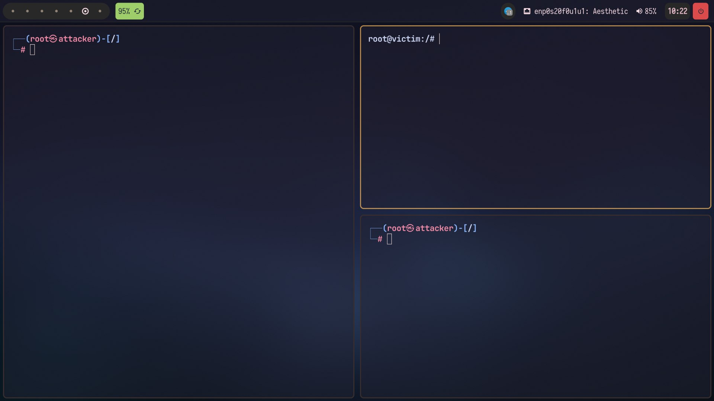

## About the project

Since my poor computer didn't have enough resources to spawn 3 virtual machines (Kali, Kali, Metasploitable) I decided to
set up a dockerized environment in order to allow me to quickly access the pentesting environment, bypassing the slowness of the graphic interfaces and catapulting myself right where the action is!

## Configuration

Simply run `docker compose up -d` from the project root. The composite will spawn 3 containers connected to each other through an internal network, therefore capable of communicating.

Now you can log into any of them via `docker exec <container> bash`  
where `<container>` can be one of these elements: 

- `Eve` the attacker (Kali)
- `Victim` the victim (Metasploitable)
- `Host` a third to carry out MITM-type attacks, or others attacks that requires a third machine

---

The `exercises` folder contains some exercises I did using the pentesting environment and `network programming` contains some client-server architectures
